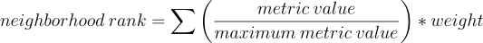

# Pittsburgh's Next Top Neighborhood
Jake's Group 10's final project for CMPINF0010, Big Ideas in Computing and Information.

Team Name: **Jake's Group 10**

## 👥 Members
| Name                 | Email               |
|----------------------|---------------------|
| Ria Chadha           |      ric42@pitt.edu |
| Pawel Morysewicz     |     pam195@pitt.edu |
| Hunter Bash          | hunterbash@pitt.edu |
| Maximillian Phillips |      max.p@pitt.edu |

## 📊 Datasets
| Dataset                                                                                         | User   | Description                                                                                                           |
|-------------------------------------------------------------------------------------------------|--------|-----------------------------------------------------------------------------------------------------------------------|
| [Crime rate](https://data.wprdc.org/dataset/pgh/resource/204f63f4-296f-4f1d-bbdd-946b183fa5a0) | Pawel  | Crime rate per neighborhood, pulled from [SNAP census data](https://data.wprdc.org/dataset/pgh).                      |
| [Commute](https://data.wprdc.org/dataset/pgh/resource/5d61b60b-bd25-4c33-8420-e31a9135ec6e)     | Max    | Percentage of method of commute per neighborhood, pulled from [SNAP census data](https://data.wprdc.org/dataset/pgh). |
| [Trees](https://data.wprdc.org/dataset/city-trees)                                              | Hunter | Survey of trees cared for and managed by the City of Pittsburgh Department of Public Works Forestry Division.         |
| [Smart Trash Containers](https://data.wprdc.org/dataset/smart-trash-containers)                 | Ria    | Air quality per area as determined by Allegheny County Health Department's Air Quality Program.                       |

## 📝 Abstract
### 🎖 Final
The goal of our project was to determine which of the many neighborhoods of Pittsburgh is the best by examining data related to commutability, trees, smart trash cans, and crime rates in these neighborhoods.

Based on the best neighborhood for each individual data category (commutability, trees, etc.), an overall ranking was created by scaling the rankings of each data category based on its importance in determining how good the neighborhood was. For example, because crime rate is more important in determining which neighborhood is better to live in, its ranking was multiplied by a factor of 5, which is much higher when compared to the commutability rank, which was just multiplied by a factor of 3. At the end of the scaling, all of the ranks for each category were added, and the neighborhood with the lowest number was determined to be the “best” neighborhood in Pittsburgh.

Based on our data and calculations, the overall best neighborhood was **Squirrel Hill North.**

## 👓 Summaries
### 🌳 Hunter
As would be expected, the amount of monetary benefit across the four metrics measured (stormwater, property value, electricity, and air quality) is directly proportional to the amount of trees in the neighborhood. It is interesting to see that much more was gained in property value benefits than in any other category (shown in Hunter_Trees.ipynb). This is likely because the other metrics were mostly environmental, and while a small number of trees on a piece of land each only make a minor impact on the environment, they can cause an immense benefit to the property value of that land. 

My best neighborhood was **Squirrel Hill South**.

### 🕵️‍ Pawel
Working with crime rates in the city of Pittsburgh was immensely interesting, and I was able to harvest accurate results from the set. Initially I started ranking the neighborhoods per amount of crime, but quickly realized that the results are naive and we need to scale it with the size of the population. I worked with both serious crimes and the lesser ones. Result from my dataset is what I expected it to be. I think most of us are aware which neighborhood is safe and my ranking accurately portrays it. 

My best neighborhood was **Squirrel Hill North**.

### 🚗 Max
The WPRDC provided plenty of data on each neighborhood’s commutes. One aspect of neighborhood quality is location, and since people spend so much of their lives working, their commute is a big factor in their quality of life. Weighing different methods of commuting by ease (such as walking to work over driving alone) was the most effective way of measuring neighborhood rank. Since no method of transportation is inherently bad, no method subtracted from a neighborhood’s quality. 

My best neighborhood was **Central Oakland**.

### 🥫 Ria
Working to compile the number of smart trash cans in each neighborhood was fairly straightforward. By examining which neighborhoods had the highest number of trash cans, we could determine that those could be considered the cleanest. Ranking the neighborhoods from highest to lowest based on the greater number of cans it was recorded to have resulted in a very clear distinction between the better, "cleaner" residencies. 

My best neighborhood was **Shadyside**.

## 🧪 Formula

Each data point was divided by the maximum value in its respective dataset, then multiplied by its weight. _Negative_ factors such as crime rate subtract from the rank. These scores were added together to find the final neighborhood score.