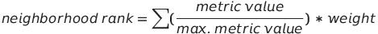

# Pittsburgh's Next Top Neighborhood
Jake's Group 10's final project for CMPINF0010, Big Ideas in Computing and Information.

Team Name: **Jake's Group 10**

## 👥 Members
| Name                 | Email               |
|----------------------|---------------------|
| Ria Chadha           |      ric42@pitt.edu |
| Pawel Morysewicz     |     pam195@pitt.edu |
| Hunter Bash          | hunterbash@pitt.edu |
| Maximillian Phillips |      max.p@pitt.edu |

## 📊 Datasets
| Dataset                                                                                         | User   | Description                                                                                                           |
|-------------------------------------------------------------------------------------------------|--------|-----------------------------------------------------------------------------------------------------------------------|
| [Crime rate](https://data.wprdc.org/dataset/pgh/resource/204f63f4-296f-4f1d-bbdd-946b183fa5a0) | Pawel  | Crime rate per neighborhood, pulled from [SNAP census data](https://data.wprdc.org/dataset/pgh).                      |
| [Commute](https://data.wprdc.org/dataset/pgh/resource/5d61b60b-bd25-4c33-8420-e31a9135ec6e)     | Max    | Percentage of method of commute per neighborhood, pulled from [SNAP census data](https://data.wprdc.org/dataset/pgh). |
| [Trees](https://data.wprdc.org/dataset/city-trees)                                              | Hunter | Survey of trees cared for and managed by the City of Pittsburgh Department of Public Works Forestry Division.         |
| [Air Quality](https://data.wprdc.org/dataset/allegheny-county-air-quality)                      | Ria    | Air quality per area as determined by Allegheny County Health Department's Air Quality Program.                       |

## 📝 Abstract
### 👓 Summary
A TLDR summary of the findings of the project. 

Answers to the question: What is the best neighborhood? And How did you determine that answer (brief summary of metrics)

### 🧪 Formula

Each data point was divided by the maximum value in its respective dataset, then multiplied by its weight. _Negative_ factors such as crime rate subtract from the rank. These scores were added together to find the final neighborhood score.